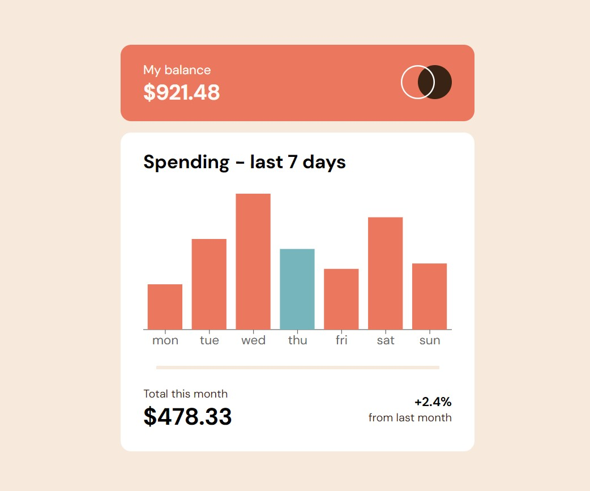

# Frontend Mentor - Expenses chart component solution

This is a solution to the [Expenses chart component challenge on Frontend Mentor](https://www.frontendmentor.io/challenges/expenses-chart-component-e7yJBUdjwt). Frontend Mentor challenges help you improve your coding skills by building realistic projects. 

## Table of contents

- [Overview](#overview)
  - [The challenge](#the-challenge)
  - [Screenshot](#screenshot)
  - [Links](#links)
- [My process](#my-process)
  - [Built with](#built-with)
  - [What I learned](#what-i-learned)
  - [Continued development](#continued-development)
  - [Useful resources](#useful-resources)
- [Author](#author)
- [Acknowledgments](#acknowledgments)


## Overview

### The challenge

Users should be able to:

- View the bar chart and hover over the individual bars to see the correct amounts for each day
- See the current day’s bar highlighted in a different colour to the other bars
- View the optimal layout for the content depending on their device’s screen size
- See hover states for all interactive elements on the page
- **Bonus**: Use the JSON data file provided to dynamically size the bars on the chart... DONE!

### Screenshot as of Thursday March 14 2024




### Links


- Solution URL:  [Github repository](https://github.com/memominguez/expenses-chart)
- Live Site URL:  [Netlify](https://expenses-chart-recharts.netlify.app)


## My process

### Built with

- Semantic HTML5 markup
- CSS custom properties
- Flexbox
- [React](https://reactjs.org/) - JS library
- [Vite](https://vitejs.dev/) - Development server
- [Recharts](https://recharts.org/en-US) - Charts library

Also, the data rendered was retrieved from a data.json file.

### What I learned

Learned about the use of Recharts library, the Barcharts section. 

Did all possible for the chart having a look the most similar to the design.

Had to elaborate a code snippet for modifying the fill color of a particular bar, that showing TODAY stuff. Provided the chart is to show 7 days of the week, Monday to Sunday. 

```js
  const [colors, setColors] = useState([])

  function makeColorsArray() {
    const now = new Date()
    // day of the week is returned Sunday to Saturday, index 0 to 6
    const day = now.getDay()
    let colorsArray = []
    for (let i = 0; i < data.length; i++) {
      if (i != parseInt(day)) {
        colorsArray.push("var(--soft-red)")
      } else {
        colorsArray.push("var(--cyan)")
      }
    }
    // Make the array Monday to Sunday
    let firstElement = colorsArray.shift()
    colorsArray.push(firstElement)
    setColors(colorsArray)
  }  
}
```


### Continued development


Continue improving my coding skills by developing challenging applications, like this one.


### Useful resources

Some video tutorials, along with recharts.org documentation

- [Recharts tutorial 1]( https://www.youtube.com/watch?v=xl5XZsOTvzY) - Examples of creating Barchart, LineChart, etc.


- [Recharts tutorial 2]( https://www.youtube.com/watch?v=62gi6foGycA) - Example of creating a Barchart


Also, some tips obtained through ChatGPT


## Author


- Website - [Guillermo Dominguez](https://gdominguez-portfolio.netlify.app)
- Frontend Mentor - [@memominguez](https://www.frontendmentor.io/profile/memominguez)


## Acknowledgments


Thanks to all those who share their knowledge, free of charge, through video tutorials in the youtube platform.
 
